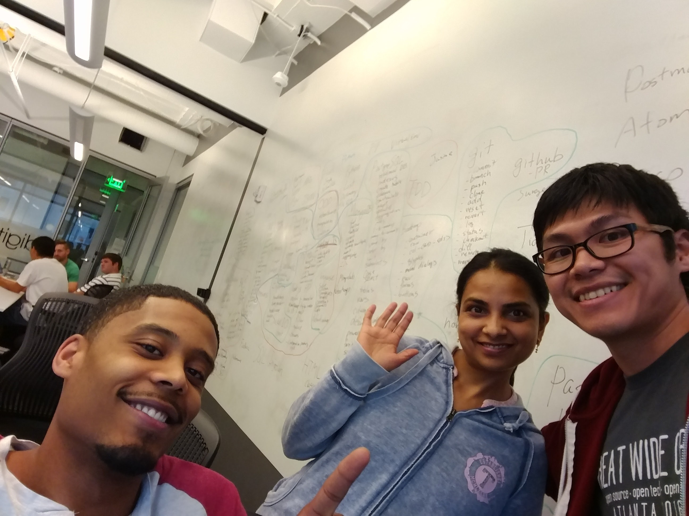
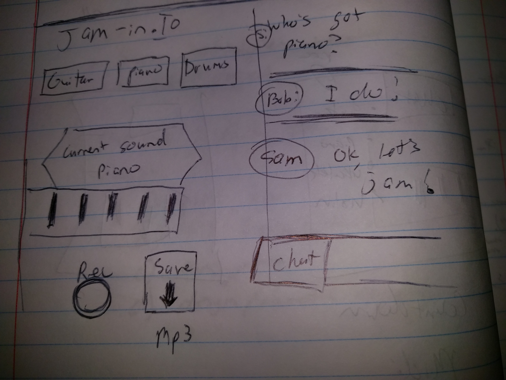
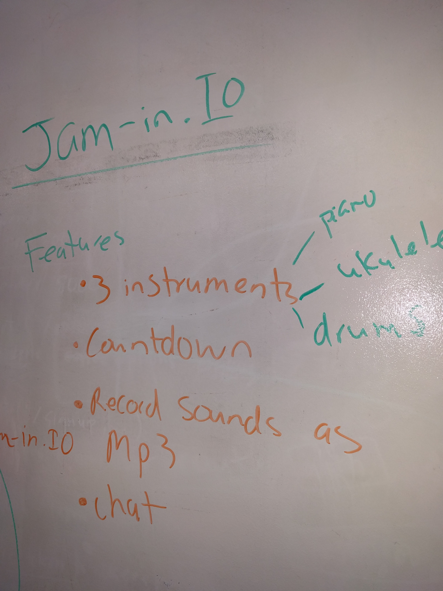
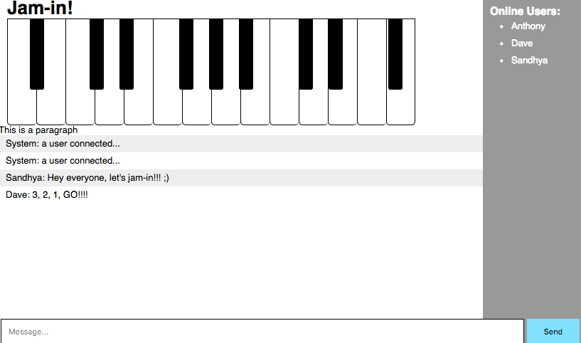

# jam-in.io
A full-stack project for DigitalCrafts utilizing everything we've learned so far. Our team is going to create a sort of "online rockband" where multiple people can visit a chat room and do real-time collaborative jam sessions.

#### Try the live demo! (used NPM now to publish)
<https://jam-in-ojbugjfigi.now.sh/>

After our scrum meeting we came up with the following tasks:
* Build the HTML5 canvas to hold the keyboard image
* Find the Web Audio API's that produce the sounds we want
* Reasearch ways to output the sounds produced in a session to MP3 format when done

## Technologies to be utilized:
* HTML5 Canvas
* Socket.IO
* MongoDB
* Web Audio API


## Phase 1: Blueprinting




## Phase 2: Using Socket.IO to emit the sounds


## Obstacles faced
* Biggest obstacle was figuring out how to emit the sounds to other users. Initially, we thought Socket.IO was capable of emmtting only text since our first experiences with it was to create a chat and draw-together app. We moved made event-listeners to keyboard clicks and emitted those clicks to other users as  way to pass the sound.

**Here's part of the frontend code that handles the sounds:**
```
keyboard.addEventListener('noteOn', function(event) {
  mouseDown= true;
  keyDown = true;
});

keyboard.addEventListener('noteOff', function(event) {
  mouseDown= false;
  keyDown = false;
});
```

**Here's part of the backend code that handles the sounds:**
```
 io.on('connection', function(socket) {

  socket.on('noteOn', function(data){
    console.log('It is playing music');
    io.emit('noteOn',data);
  });

  socket.on('noteOff', function(data){
    console.log('It is note playing music');
    io.emit('noteOff', data);
```


#### Tutorials
* http://codepen.io/matt-west/full/lAFnx
* http://code.tutsplus.com/tutorials/the-web-audio-api-make-your-own-web-synthesizer--cms-23887
* http://www.willvillanueva.com/the-web-audio-api-from-nodeexpress-to-your-browser/
* http://stackoverflow.com/questions/20643687/midi-js-unable-to-change-instruments

#### Resources (not everything was used)
* https://github.com/alemangui/web-audio-resources
* https://github.com/mudcube/MIDI.js
