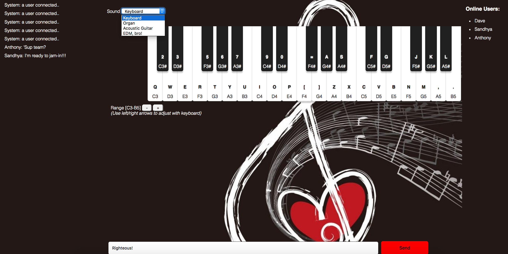

# jam-in.io
A full-stack project for DigitalCrafts utilizing everything we've learned so far. Our team is going to create a sort of "online rockband" where multiple people can visit a chat room and do real-time collaborative jam sessions.

## Try the live demo! (used NPM now to publish)
**MVP1**
<https://jam-in-ojbugjfigi.now.sh/>

**MVP2**
<https://jam-in-findwlmhka.now.sh/>

**MVP3**
<https://jam-in-drwrvobxtp.now.sh/>


## What's it made of?
* HTML, CSS, Javascript
* Bootstrap
* Node.js
* Socket.IO
* [Web Audio API](https://developer.mozilla.org/en-US/docs/Web/API/Web_Audio_API)
  * [Audiosynth](https://github.com/keithwhor/audiosynth)

## Phase 1: Blueprinting


## Obstacles faced in Phase 1
* We had a lot of ideas and had to prioritize the most important ones to knock out first: making sure the chat and keyboards work independently, then combine them later. We also had to do a lot of research on Web Audio API. With most API's, it's used to connect to databases to get information. With W.A.A. it comes integrated in browsers that support it and produces sound without having to take up so much memory.

#### After our scrum meeting we came up with the following tasks:
* Build the HTML5 canvas to hold the keyboard image
* Find the Web Audio API's that produce the sounds we want
* Reasearch ways to output the sounds produced in a session to MP3 format when done

## Phase 2: Using Socket.IO to emit the sounds, QWERTY Hancock keybaord integration


## Obstacles faced in Phase 2
* Biggest obstacle was figuring out how to emit the sounds to other users. Initially, we thought Socket.IO was capable of emmtting only text since our first experiences with it was to create a chat and draw-together app. We moved made event-listeners to keyboard clicks and emitted those clicks to other users as  way to pass the sound.

###Phase 2 code:
**Here's part of the frontend code that handles the sounds:**
```js
keyboard.addEventListener('noteOn', function(event) {
  mouseDown= true;
  keyDown = true;
});

keyboard.addEventListener('noteOff', function(event) {
  mouseDown= false;
  keyDown = false;
});
```

**Here's part of the backend code that handles the sounds:**
```js
 io.on('connection', function(socket) {

  socket.on('noteOn', function(data){
    console.log('It is playing music');
    io.emit('noteOn',data);
  });

  socket.on('noteOff', function(data){
    console.log('It is note playing music');
    io.emit('noteOff', data);
```

## Phase 3: JS Dynamic Audio Synth integration to produce more instruments, tightened up sound emit functionalties



## Contributors
* [Dave](https://github.com/phamous2day): Led scrum meetings, researched technologies necessary, compiled documentation for README.md
* [Sandhya](https://github.com/ramsandhya): Consolidated the chat and keyboard codes into compact form, restructured final designs and layout
* [Anthony](https://github.com/Athompsonjr26 ): Problem-solved layout issues, helped gather clues to emitting sounds via Socket.io


#### Tutorials
* http://codepen.io/matt-west/full/lAFnx
* http://code.tutsplus.com/tutorials/the-web-audio-api-make-your-own-web-synthesizer--cms-23887
* http://www.willvillanueva.com/the-web-audio-api-from-nodeexpress-to-your-browser/
* http://stackoverflow.com/questions/20643687/midi-js-unable-to-change-instruments

#### Resources (not everything was used)
* https://github.com/alemangui/web-audio-resources
* https://github.com/mudcube/MIDI.js
* https://github.com/keithwhor/audiosynth
